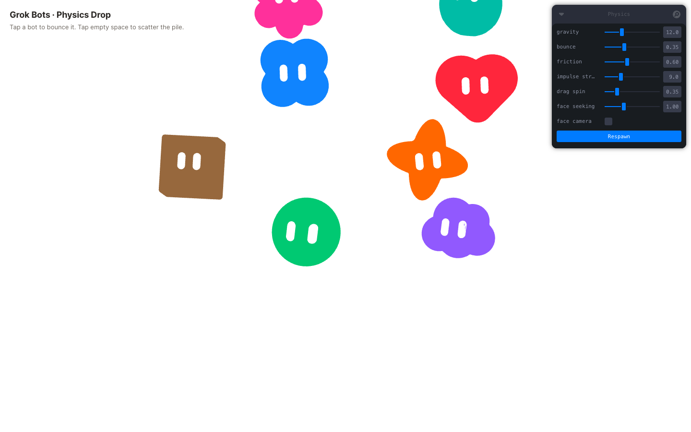
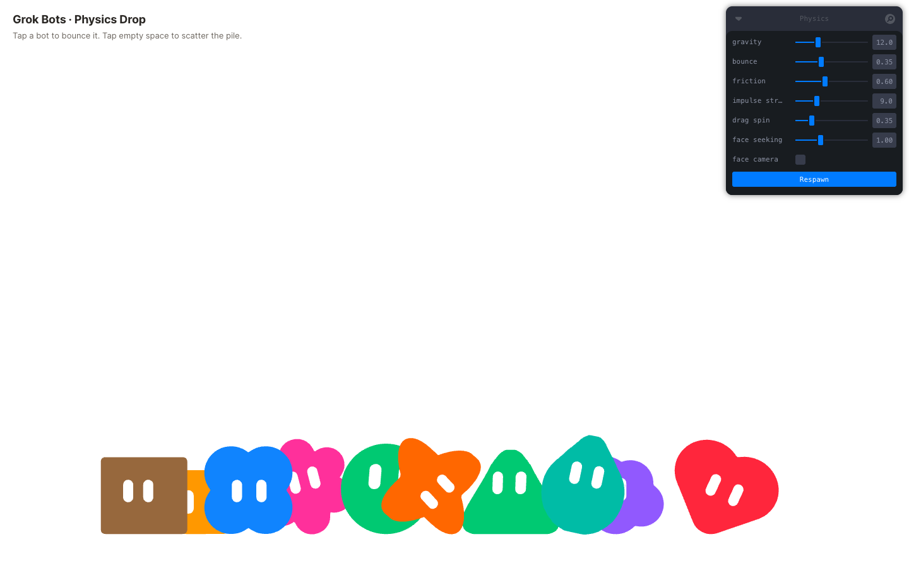

# Grok Bots · Physics Drop

A standalone web prototype: the ten Grok Bot "Base shapes v2" bodies as true 3D
volumes rendered the way the Sand-Toolkit tool renders them (flat solid token
color, white pill eyes charted on the body surface, no lighting or shadows),
dropped into a physics box where they tumble, stack, settle, and can be poked
and spun.





Built with Vite, React, TypeScript, three.js, React Three Fiber, drei, Rapier
(`@react-three/rapier`) and Leva.

## Run

```bash
npm install
npm run dev
```

Opens on <http://127.0.0.1:4731/> (fixed port, see `vite.config.ts`).

## Controls

- **Tap / click a bot** — kicks it upward with a little spin.
- **Drag a bot** — turns it in place like a tile in the tool (yaw with
  horizontal drag, pitch with vertical, 0.35°/px by default); release with a
  flick to spin it. It is held in the air while dragged.
- **Tap / click empty space** — radial scatter burst from that point.
- **Leva panel (top right)**
  - `gravity` — downward acceleration.
  - `bounce` — collider restitution.
  - `friction` — collider friction.
  - `impulse strength` — size of the tap kick and scatter burst.
  - `drag spin` — degrees of rotation per pixel of drag.
  - `face seeking` — a soft weeble torque that swings tumbling bots back to face
    the camera upright, so eyes stay readable once they settle. 0 disables it.
  - `face camera` — off by default (full 3D tumbling). On: bots keep their
    face toward the viewer (no depth travel, spin only about the view axis).
  - `Respawn` — re-drops all ten bots with reshuffled colors.

Works with touch on mobile; the panel starts collapsed on narrow screens.

## Troubleshooting

If the title and panel render but the scene is blank, an on-screen card says
which stage failed and prints diagnostics (WebGL renderer string, WebAssembly
availability, viewport, user agent):

- **WebGL is not available / WebGL context creation failed** — the browser has
  WebGL or GPU access disabled. Cursor's built-in browser tab is known to do
  this (`Sandboxed = yes … BindToCurrentSequence failed`). Open the URL in
  Chrome, Safari or Firefox instead.
- **Physics engine (Rapier WASM) failed to load** — WebAssembly compilation is
  blocked (CSP or policy).
- **Runtime error / The scene crashed** — a JavaScript error; the message is shown.

## Data sources

Copied read-only from the Sand-Toolkit repo:

- `src/data/shapes.ts` — the ten SVG outlines (229-unit box) from
  `figma-plugins/baby-grok-expressions/src/grok-bot/shapes.ts`, roster order from
  `web/src/baby-grok/BabyGrokBaseShapesV2App.tsx` (`BASE_SHAPES_V2`).
- `src/data/bodies.ts` — the 3D body definitions and eye formations, dumped by
  running the tool's own code: `playgroundSpec(form, true)` from
  `web/src/star/playgroundBodies.ts` (rounded-slab extrusions for sparkle,
  clover, flower; rounded lofts for cloud and chubby heart; surfaces of
  revolution for teardrop and wedge; a ball-chain capsule for tablet; a rounded
  cube for square; the blob is the unit sphere) and `buildParams(form,
  "neutral", "front")` from `web/src/baby-grok/BabyGrokShapeCollectionApp.tsx`
  plus the per-tile tuning in `BabyGrokBaseShapesV2App.tsx`.
- `src/data/tokens.ts` — the 12 core color tokens from
  `web/src/baby-grok/alphaLadder.ts` (`ALPHA_CORE_RGB`). Bots use the nine hues
  (black, white and gray are skipped), so one hue repeats across ten bots.

## How it works

- `src/geometry.ts` turns each body definition into a signed distance field,
  extracts the surface with three's `MarchingCubes`, and drapes two white pill
  eyes onto it (each eye vertex is pushed along the view axis until it meets the
  surface, then lifted a hair). Bodies use an unlit `MeshBasicMaterial` with the
  exact token hex; eyes are paper-white, like the tool's carved eyes.
- `src/Bot.tsx` wraps each body in a Rapier `RigidBody` with a convex-hull
  collider built from a thinned copy of the mesh vertices (ball/box fallback if
  the hull fails), and handles tap, drag-to-rotate and flick.
- `src/Scene.tsx` sets up an orthographic camera looking down -Z, an invisible
  floor and walls at the viewport edges, a shallow front/back slab, the
  face-seeking torque, click handling and the Leva panel.
