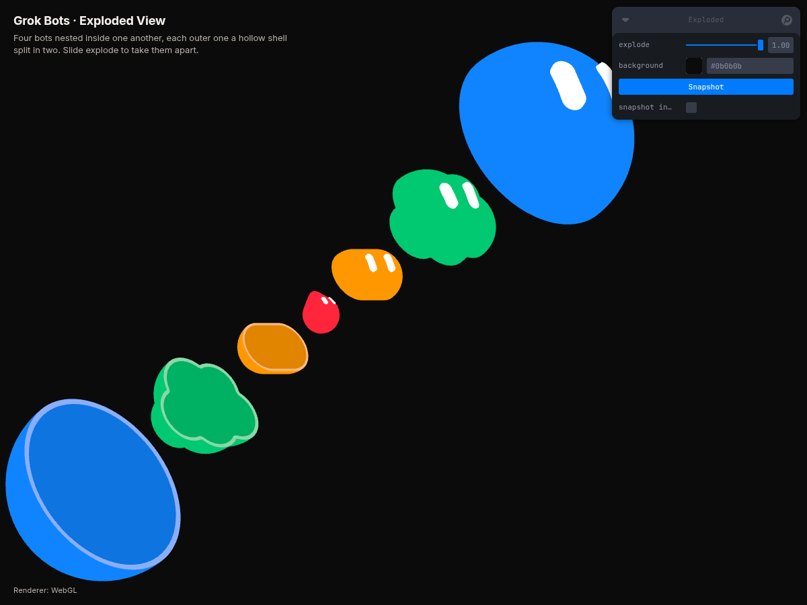
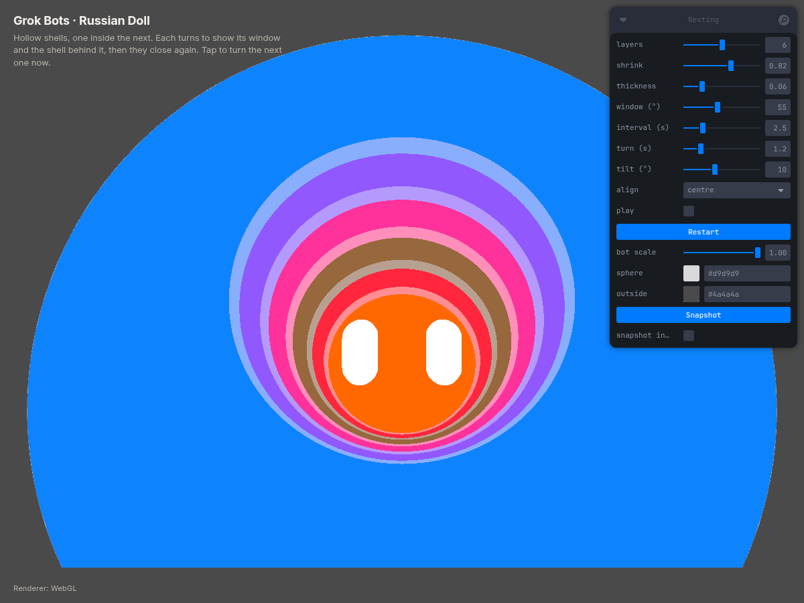
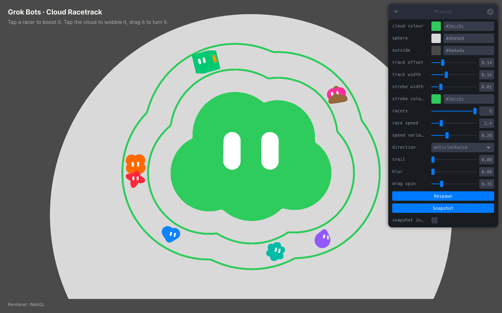
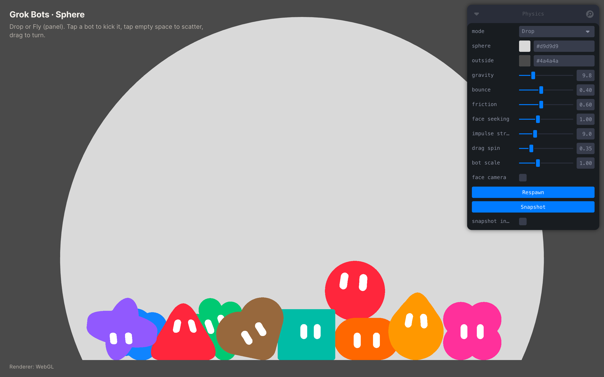
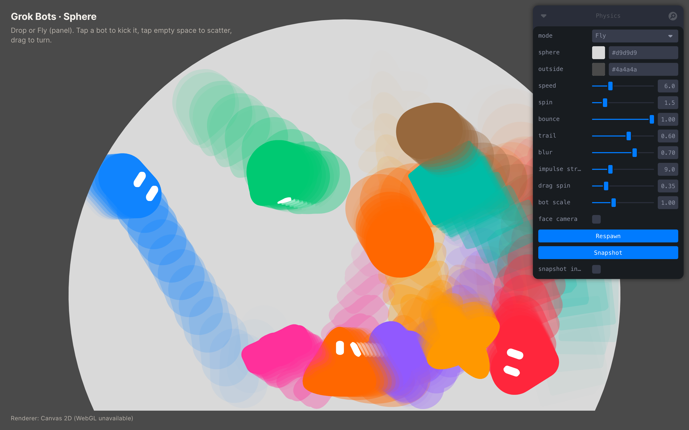
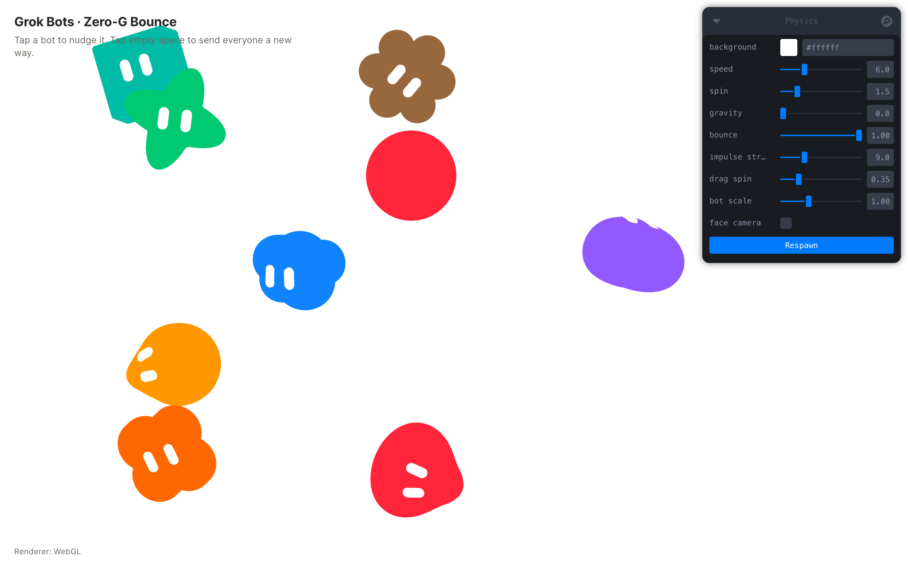
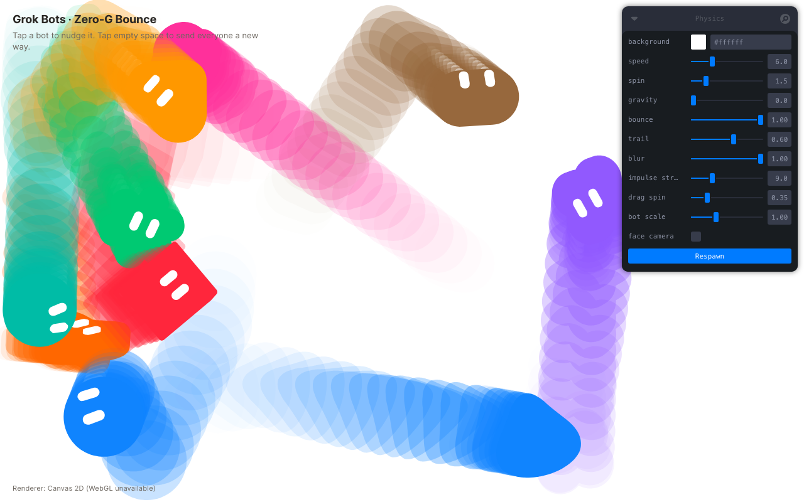
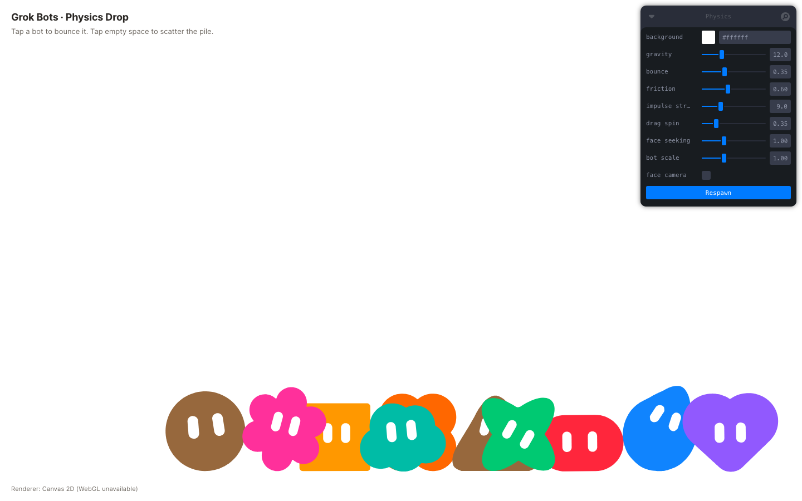

# Grok Bots · Physics Drop

A standalone web prototype: the ten Grok Bot "Base shapes v2" bodies as true 3D
volumes rendered the way the Sand-Toolkit tool renders them (flat solid token
color, white pill eyes charted on the body surface, no lighting or shadows),
dropped into a physics box where they tumble, stack, settle, and can be poked
and spun.


Built with Vite, React, TypeScript, three.js, React Three Fiber, drei, Rapier
(`@react-three/rapier`) and Leva.

## This branch: `exploded` — exploded view

Branched from `nesting` (head `372e7b3`). Four different bots nested inside
one another — the sphere (`blob`), the `cloud`, the `tablet` and a
`teardrop` core — each outer one a hollow shell split into a front and a back
half, shown in a 3/4 view on a plain dark field like a product exploded
diagram. One `explode` slider slides the seven pieces apart along a diagonal.
No Sphere container, no cascade. Live at
<https://monish-khara.github.io/grok-bot-physics/exploded/>.



- **Pieces** (`buildPieces` in `src/Scene.tsx`): outer to core, `blob`
  (blue, size 1), `cloud` (green, 0.68), `tablet` (yellow, 0.46),
  `teardrop` (red, 0.3), sizes as bounding radius over the outer's (1.6
  world units). Each size is capped so every vertex of the body sits at
  least a wall thickness inside the body around it, found by bisection on
  the outer body's SDF (`maxFitScale`), with 8% clearance: the cloud fits
  at 0.68 (limit 0.94), the tablet at 0.433 (limit 0.47, its own depth is
  what limits it inside the cloud), the teardrop at 0.235 (limit 0.255 —
  the tablet's round cavity is only 0.59 of its length across). The fit
  results are in `window.__grokExploded().fits`.
- **Half shells** (`src/halfShell.ts`): `shell = body − erode(body, 0.06 R)`,
  split at `z = 0` in the bot's own frame (+z is the direction it faces and
  also the explode axis, so the cut is perpendicular to the slide and the
  eyes stay on the front half). Built from the body's mesh rather than by
  re-sampling its SDF: the outer face is the toolkit shape's own analytic
  mesh; the inside is that mesh pushed inward along its vertex normals and
  Newton-snapped onto the SDF's `−thickness` level set; both are
  plane-clipped (the face runs a hair past the cut so it, not the rim, is
  what anti-aliases along the seam); the flat cut rim is the annulus between
  the body's `sdf = 0` and `sdf = −thickness` contours on the plane,
  ray-marched per angle (all four bodies are star-shaped about their
  centre). Tones as on `nesting`, one flat colour per triangle baked as
  vertex colours: token colour on the face, 25% toward white on the cut
  rim, 25% toward black inside. Face, rim and inside are three geometry
  groups; WebGL draws the rim with a polygon offset so the face wins depth
  ties along the shared cut edge (otherwise the lighter rim bleeds into the
  seam at explode 0). The core is the solid `teardrop`. Eyes are each bot's
  own pills on its front half and on the core.
- **View:** orthographic camera straight on; the assembly group is turned
  yaw 42°, pitch 28° (a little more across the axis than the classic 35/25,
  so a front half's face — which points up the axis at the next, larger,
  nearer piece — is not covered by it), which puts the axis lower-left to
  upper-right on screen with the front halves nearer. Plain page colour
  behind a transparent canvas (`background` picker, default `#0b0b0b`).
- **Explode:** order along the axis back L0, back L1, back L2, core, front
  L2, front L1, front L0; each piece's full offset is the sum of the gaps
  outward of it, a gap being 1.8 × that layer's radius (so the stack reads
  evenly and no piece overlaps another at 1); the slide is
  `offset × smoothstep(explode)`. At 0 a single closed sphere bot with eyes;
  at 1 seven separated pieces with cavities, cut rims and eyes on every
  front and on the core.
- **Snapshot:** the assembly as drawn, on transparent, cropped to the
  pieces' projected bounds (both renderers already draw onto a transparent
  canvas). `snapshot in tab` as before.
- **Canvas 2D** (`src/canvas2d.ts`): all seven pieces are `perTriangle`
  (the core too, so the painter's order holds in the 3/4 view) at the new
  `sketch` mesh quality (~12k painted triangles, ~8 ms a frame at 1200×900).
  The painter now quantises depth in fixed world-unit slabs, pushes each
  body's rim and inside groups behind its face, paints each eye as one
  silhouette path just after its body's nearest triangle (nothing of a body
  can be in front of its own eye), and grows triangles by a true edge
  offset so thin slivers close up too.
- **Leva:** `explode` (0–1, default 0.6; `?explode=` presets it),
  `background`, `Snapshot`, `snapshot in tab`. Nothing else.
  `?renderer=canvas2d` forces the fallback.
- **Test hooks:** `window.__grokExploded()` (explode and eased value,
  quality, per-layer radii and fit results, every piece's offset, current
  slide, triangle count and world position), `__grokScene()`. Verified
  headless at 1200×900 with SwiftShader WebGL and with the Canvas 2D
  renderer at explode 0, 0.5 and 1: a closed sphere with eyes at 0 (no seam
  at the cut); at 0.5 the inner bots visible and correctly nested in the
  back halves' cavities; at 1 all seven pieces separated with clear
  cavities, lighter cut rims, darker insides, eyes on every front half and
  the core, no piece overlapping another, no z-fighting on the cut faces;
  no console errors.
- **Run alongside the other branches:** worktree
  `~/repos/grok-bot-physics-exploded`, port `4737`:

  ```bash
  cd ~/repos/grok-bot-physics-exploded
  npm install
  npm run dev -- --port 4737 --strictPort
  # → http://127.0.0.1:4737/
  ```

  Or detached: `screen -dmS grok-bot-physics-exploded bash -lc 'cd ~/repos/grok-bot-physics-exploded && npm run dev -- --port 4737 --strictPort 2>&1 | tee /tmp/grok-bot-physics-exploded.log'`.
- Rapier is still unused here (the dependency remains in `package.json`).

## This branch: `nesting` — Russian doll shells

Branched from `racetrack` (head `badf622`). The Sphere, its colours and the
transparent Snapshot stay; the track and the racers go. A stack of hollow
dome shells sits one inside the next, the outermost filling the Sphere (its
silhouette *is* the Sphere's) and a solid dome bot at the core. Each shell has
a round window on its back. Every few seconds the outermost shell turns 180°
in place so its window comes round to the camera and you look through it at
the next shell's face and eyes; then that one turns, and so on to the core.
Then they close again from the inside out, and the loop restarts. Live at
<https://monish-khara.github.io/grok-bot-physics/nesting/>.



- **Dome body** (`src/data/bodies.ts`, `dome`): none of the ten toolkit
  shapes is a dome, so this branch adds one — the unit sphere sliced flat at
  `y = CHORD` (`-0.42`, the same cut as `src/sphereShape.ts`), built as a
  surface of revolution through the existing `revolve` path. Scaled to the
  Sphere's radius with its base on the Sphere's floor it fills the interior
  exactly. Eyes are white pills 0.6 R apart and 0.56 R up; the `upright`
  eye-frame option keeps their height axis vertical on screen (the
  surface-normal frame would splay a pair set this high on a sphere).
- **Shell** (`src/shell.ts`): `shell = dome − erode(dome, thickness) − window`,
  where the erosion leaves a wall `thickness` (default 0.06 of that shell's
  outer radius, slider) thick including a floor, and the window is a cone
  about an axis on the back at eye height, `window` degrees wide (default 55,
  slider 20–100; above ~100 it would cut into the base). The plan called for
  marching cubes over that SDF; the shell is built from its parts instead —
  outer and inner spheres about the window axis, the conical rim of the
  window, the base disc and the cavity floor, plane-clipped at the chord —
  because that gives exact surfaces at any wall thickness (a 0.06 R wall is
  one or two grid cells at a resolution the Canvas 2D fallback can paint),
  crisp per-part tones, ~19k triangles per shell (`high`) or ~3.4k (`low`),
  and instant rebuilds when a slider moves. Three flat tones are baked as
  vertex colours: the token colour on the face, 25% toward white on the rim,
  25% toward black inside; `MeshBasicMaterial` with `vertexColors`, still
  unlit. Eyes are the dome's own pills (same outer surface), so they go
  round the back when a shell turns and the depth test hides them.
- **Layers:** `layers` (2–10, default 6) with the last one the solid dome.
  Layer 0 is `bot scale × Sphere radius`; layer *i* is scaled by `shrink`ⁱ
  (0.82). Colours walk the core token ladder from blue (blue, violet,
  magenta, brown, red, orange, yellow, green, cyan — nine hues, so neighbours
  never match); eyes are white on every layer. All layers are drawn (you look
  into them). `align`: `centre` (default) — every shell shares the dome's
  sphere centre, like the reference — or `floor`, each standing on the
  Sphere's floor. `tilt` (0–25°, default 10) pitches the whole stack toward
  the camera so the rims show; it turns the stack, not the camera, so the
  Sphere stage and its clipping are untouched.
- **Cascade** (`Nesting` in `src/Scene.tsx`): hold `interval` s (2.5), then
  the outermost unturned shell turns 180° about its own vertical axis over
  `turn` s (1.2, ease-in-out); hold; the next turns; … until only the core
  faces you. Hold, then the shells turn back from the innermost outwards
  (0.4 s apart) and the loop restarts. Shells are opaque throughout — no
  fading. **Tap** any layer to end the current hold now. `play`, `Restart`
  kept; drag-to-rotate is gone so the turns read clearly.
- **Canvas 2D** (`src/canvas2d.ts`): a silhouette fill cannot show a window
  with another shell inside it, so bodies flagged `perTriangle` (the shells;
  `Figure` sets `userData.perTriangle`) go through a global painter: every
  front-facing triangle of every shell and of its camera-facing eyes is
  projected, sorted far to near by view depth (quantised into 200 slabs with
  the colour as tie-break, so one surface paints as one run even where an
  occluded surface behind it interleaves in depth) and filled with its own
  baked tone; ordinary silhouette bodies — the core — are slotted into the
  same order at their centre depth, so the core paints after the shells'
  back walls and before their front walls. Eyes get a small forward depth
  bias so they land on top of the face they sit in. Same-colour runs merge
  into one `Path2D`, and every triangle is grown half a pixel about its
  centroid, which removes the anti-aliased hairlines abutting fills would
  leave. Measured ~5 ms a frame for six layers at 1200×900 (`low` quality,
  ~6.7k triangles after culling).
- **Leva:** `layers`, `shrink`, `thickness`, `window (°)`, `interval (s)`,
  `turn (s)`, `tilt (°)`, `align`, `play`, `Restart`, `bot scale`, `sphere`,
  `outside`, `Snapshot`, `snapshot in tab`. `?play=0` starts paused;
  `?renderer=canvas2d` forces the fallback.
- **Test hooks:** `window.__grokNesting()` (mode `open`/`close`, the layer
  turning, time in step, every layer's turn 0–1 and radius),
  `__grokNestingSet({ layer, mode, t })` to jump the timeline,
  `__grokBotBounds()` (the Sphere), `__grokScene()`. Verified headless at
  1200×900 with SwiftShader WebGL and with the Canvas 2D renderer: `npm run
  build` and `tsc --noEmit` clean; at rest the outer shell fills the Sphere
  with eyes visible; mid-turn (0.65 of the outer shell's turn) the window
  swings in showing the lighter rim, the darker inside and the next shell's
  face and eye through it, with the eyes on the turning shell gone round the
  back; fully open, five nested rims frame the core; no z-fighting; a 45 s
  live run walks open 0→5, close 4→0 and restarts; a tap during a hold jumps
  to the turn; `align: floor` and a 110° window checked too; no console
  errors.
- **Run alongside the other branches:** worktree
  `~/repos/grok-bot-physics-nesting`, port `4736`:

  ```bash
  cd ~/repos/grok-bot-physics-nesting
  npm install
  npm run dev -- --port 4736 --strictPort
  # → http://127.0.0.1:4736/
  ```

  Or detached: `screen -dmS grok-bot-physics-nesting bash -lc 'cd ~/repos/grok-bot-physics-nesting && npm run dev -- --port 4736 --strictPort 2>&1 | tee /tmp/grok-bot-physics-nesting.log'`.
- Rapier is still unused here (the dependency remains in `package.json`).

## This branch: `racetrack` — the cloud racetrack

Branched from `sphere`. The Sphere, its colours and the transparent Snapshot
stay; the Drop/Fly physics goes. One big green cloud sits at the centre, two
thin green strokes run around it at a constant distance from its silhouette
— a real *Offset Path*, not a scaled copy — and the other nine bots race
around the lane between them. Live at
<https://monish-khara.github.io/grok-bot-physics/racetrack/>.



- **Offset paths** (`src/racetrack.ts`): scaling an outline moves its convex
  parts too far and its concave parts too little, which is what looked wrong.
  An offset curve at distance *d* is instead the iso-line `sdf(x, y) = d` of
  the shape's signed distance function, and the cloud already has one:
  `src/geometry.ts` builds each body from an SDF, and `botSilhouette()` now
  exposes the exact 2D distance to its front outline (the loft's drawn ring,
  ungridded). The track is extracted from it by **marching squares** on a
  224² grid of the field (sampled once), chained into loops (the longest is
  the offset), **Newton-snapped** onto the exact iso-line, run through a
  closed centripetal **Catmull-Rom** and resampled to 320 points by arc
  length, then snapped again. Convex corners come out as circular arcs of
  radius *d*; where two bumps' offsets meet in a notch there is a crease,
  exactly as in Illustrator. The inner stroke is at `d1`, the outer at
  `d1 + width`, and the racers' centreline at `d1 + width / 2`, all from the
  same field, so slider changes recompute in a few milliseconds. (A distance
  transform of the rendered silhouette was the planned fallback; it was not
  needed.) Headless check: 200 samples per stroke are within **0.00%** of
  the target distance to the cloud polygon, measured independently.
- **Rendering:** Canvas 2D strokes the two polylines (`stage.strokes`, round
  joins, world-unit width) right after the interior fill, so they sit
  behind the racers; WebGL builds flat ribbon meshes from the same points
  at `z = -1.5`. Both go through the existing trail/blur and Snapshot paths.
- **Cloud:** 40% of the Sphere's width, centred in the shape's bounding box,
  face to the camera, colour `#2ecc5c` (`cloud colour`). Drag turns it like
  a tile (`drag spin` °/px); a tap gives it a damped squash-and-stretch
  wobble. The track never moves.
- **Racers** (`src/Figure.tsx`, no physics bodies): the nine non-cloud bots
  at 12% of the cloud's width, token colours, eyes on. Each has an arc-length
  phase `s` on the centreline advanced by `race speed × (1 ± variance)` (a
  fixed per-racer factor, so they overtake), an even starting spread, a
  small bob, a lean into the direction of travel and a slight yaw toward it
  so the eyes still read. A tap gives a 1.6 s boost (up to 2.4×).
- **Leva:** `cloud colour`, `sphere`, `outside`, `track offset` (d1),
  `track width`, `stroke width` (all as fractions of the cloud's width),
  `stroke colour`, `racers` (0–9), `race speed` (world units/s),
  `speed variance`, `direction`, `trail`, `blur`, `drag spin`, `Respawn`
  (re-spreads the field, re-rolls colours and speed factors), `Snapshot`,
  `snapshot in tab`. `?trail=&blur=` presets still work.
- **Test hooks:** `window.__grokTrack()` (both strokes, the centreline, the
  cloud outline, all in world units, plus `d1`, `d2`, sizes),
  `window.__grokRacers()` (`s`, speed factor, boost), `__grokBotPositions()`
  (racers), `__grokBotBounds()` (the Sphere). Verified headless with WebGL
  disabled and with SwiftShader WebGL: strokes within 2% (measured 0.00%) of
  `d1`/`d2`, nine racers present and inside the lane band and the Sphere for
  60 s, taps boost, no console errors.
- **Run alongside the other branches:** worktree
  `~/repos/grok-bot-physics-racetrack`, port `4735`:

  ```bash
  cd ~/repos/grok-bot-physics-racetrack
  npm install
  npm run dev -- --port 4735 --strictPort
  # → http://127.0.0.1:4735/
  ```

  Or detached: `screen -dmS grok-bot-physics-racetrack bash -lc 'cd ~/repos/grok-bot-physics-racetrack && npm run dev -- --port 4735 --strictPort 2>&1 | tee /tmp/grok-bot-physics-racetrack.log'`.
- Rapier is no longer used on this branch (the dependency is still in
  `package.json`; nothing imports it).

## This branch: `sphere` — the bots inside the Sphere

Branched from `fly`. The rectangular box is replaced by the silhouette of the
Las Vegas Sphere's Exosphere — a circle with its bottom sliced off by a flat
base — drawn as a light grey shape on a dark grey field, and a `mode` toggle
at the top of the panel switches between **Drop** (the bots fall and settle
on the base) and **Fly** (the zero-gravity screensaver, now bouncing off the
curve).





- **Shape** (`src/sphereShape.ts`): the real Exosphere is ~516 ft wide by
  366 ft tall, i.e. height = 0.71 × diameter, so the shape is a circle of
  radius `R` cut by a horizontal chord at `y = -0.42 R` (height `1.42 R`).
  `fitSphere` sizes `R` to the viewport with a 0.45-unit margin and centres
  the shape; it is recomputed on resize. One definition feeds the physics
  walls, both renderers' backdrops, spawn sampling and the test hooks.
- **Physics:** the four frustum walls are gone. The arc is a static ring of
  96 thin cuboid colliders whose inner faces lie on the circle (each slightly
  overlong so there are no gaps at the joints), the base is one flat collider
  along the chord, and the shallow front/back planes stay. Bot colliders are
  unchanged.
- **Visual:** the interior is filled behind the bots and everything outside
  is another colour. Two Leva colours replace `background`: `sphere`
  (interior, default `#d9d9d9`) and `outside` (default `#4a4a4a`, also the
  page colour). Canvas 2D fills the outside, fills the shape as a `Path2D`,
  then clips to it, so bodies, trails and blur ghosts never leave the
  interior. WebGL renders the scene into the float render target (cleared or
  washed to the interior colour), clears the screen to the outside colour and
  draws the target through a flat mesh triangulated from the same outline,
  textured in screen space — which is what clips the trails and blur.
- **Spawn:** positions are rejection-sampled inside the shape, inset from the
  walls by 0.7 of a bot and spaced at least a bot apart (relaxed if the
  Sphere is small). Drop samples the upper half so the fall is visible.
- **Mode** — `mode: Drop | Fly` is the first row of the panel; `?mode=fly`
  (or `drop`) picks the starting mode, default Drop.
  - *Drop:* gravity 9.8, bounce 0.4, friction 0.6, linear/angular damping
    0.15 / 1.4, bodies may sleep, the speed normaliser is off, trail and blur
    are forced to 0, and the `face seeking` weeble torque from `master` is
    back (it swings a tumbling bot toward face-forward; the torque skips
    sleeping bodies and never resets their sleep timer, so a slab rocking on
    its face settles instead of jiggling forever). Tapping a bot kicks it
    upward; tapping empty space is a radial burst from the click point.
  - *Fly:* gravity 0, bounce 1, no friction or damping, never sleeps, the
    normaliser holds every bot at `speed`, `trail` defaults to 0.6 and `blur`
    to 0.7 with their sliders visible (`?trail=&blur=` still preset them).
    Taps and scatters behave as on `fly`.
  - Each mode keeps its own sliders (only the active mode's are shown), so
    tweaks persist when switching back and forth. Switching respawns the
    troop under the new rules and swaps the physics live.
- **Kept:** tap impulse, empty-click scatter, drag-to-rotate and flick,
  `bot scale`, `face camera`, `Respawn`, `Snapshot` and the WebGL / Canvas 2D
  auto-detect.
- **Snapshot is just the Sphere:** the PNG is the interior colour with the
  bots, trails and blur inside it, and everything outside the truncated
  circle is fully transparent (alpha 0, no `outside` colour), cropped to the
  shape's bounding box at native pixel size (2052×1457 for a 1280×800 window
  at 2×) — drop it straight onto any background. The arc's edge is
  anti-aliased.
  - *Canvas 2D:* the renderer redraws the last frame into an offscreen canvas
    with no outside fill (`Canvas2DRenderer.snapshot()`), reusing the live
    trail history without advancing it, then keys the whole frame through an
    ordinary anti-aliased fill of the shape path (`destination-in`), so the
    edge is soft even where a browser's `clip()` is not.
  - *WebGL:* one frame is drawn with the screen cleared to alpha 0 instead of
    the outside colour, so only the MSAA-edged Sphere mesh (textured with the
    trail render target) lands in the drawing buffer; it is copied into the
    cropped canvas and the normal frame is drawn straight back, so nothing
    flashes on screen.
  - `snapshot in tab` and `window.__grokLastSnapshot` work as before. Verified
    headless in both renderers at 1× and 2×: all four corners alpha 0, the
    opaque fraction of the PNG equals the truncated circle's share of its
    bounding box (83.8% vs 84.0%), a band of partial-alpha pixels along the
    arc, interior colour and bots present.
- **Run alongside the other branches:** worktree `~/repos/grok-bot-physics-sphere`,
  port `4734` (`master` 4731, `canvas2d` 4732, `fly` 4733):

  ```bash
  cd ~/repos/grok-bot-physics-sphere
  npm install
  npm run dev -- --port 4734 --strictPort
  # → http://127.0.0.1:4734/
  ```

  Or detached: `screen -dmS grok-bot-physics-sphere bash -lc 'cd ~/repos/grok-bot-physics-sphere && npm run dev -- --port 4734 --strictPort 2>&1 | tee /tmp/grok-bot-physics-sphere.log'`.
- **Test hooks:** `window.__grokBotBounds()` now returns the fitted shape
  `{ cx, cy, r, chordY, mode }`; positions and velocities as before. Verified
  headless (1280×800) with WebGL disabled (Canvas 2D) and with SwiftShader
  WebGL: 60 s of Fly with no bot centre outside the truncated circle and
  speeds within 0.001 of the target; 30 s of Drop with all ten asleep on the
  base and none through the arc; five mode toggles with ten bodies inside
  the shape after each and no console errors.

## This branch: `fly` — zero-gravity bounce

Branched from `canvas2d` (so it keeps the WebGL / Canvas 2D auto-detect and
runs in Cursor's built-in browser). Instead of dropping into a pile, the ten
bots drift through the viewport at one constant speed, spinning gently, and
bounce off the frame edges like a screensaver.



- **Physics:** gravity defaults to `0`; every bot spawns spread over the
  visible area (jittered grid, so none start overlapping) with a random
  heading at the shared `speed` and a small random spin. Rigid bodies use
  restitution `1`, friction `0`, no linear or angular damping, never sleep,
  and have CCD on so a fast bot cannot tunnel through a wall.
- **Walls:** six invisible colliders sized from the camera frustum — left,
  right, top, bottom, plus a shallow front/back pair — so the troop stays in
  one depth band and always in frame. They resize with the window.
- **Speed normaliser:** after every physics step each free-flying bot's
  velocity is rescaled to exactly `speed` (the solver's elastic bounces and
  bot-bot collisions are never quite lossless), and its spin is capped at
  `spin`. A bot that has stopped (released from a drag without a flick) is
  sent off in a fresh random direction. The normaliser only runs while
  `gravity` is `0`; raise gravity and the bots fall and bounce elastically.
- **Interaction:** tapping a bot shoves it in a random direction (the
  normaliser turns that into a change of heading) with some spin; tapping
  empty space gives every bot a new random heading and spin; drag-to-rotate
  and flick work as before, and a flick also sets the release heading.
- **Leva panel:** `speed` (default 6 units/s), `spin` (default 1.5 rad/s,
  also the cap), `gravity` (default 0), `bounce` (default 1), `trail`,
  `blur`, `impulse strength`, `drag spin`, `bot scale`, `face camera`,
  `Respawn`. `friction` and `face seeking` are gone: friction no longer
  matters, and the face-seeking torque would oscillate forever with no damping.

### Trails and speed blur



Two effect sliders, both `0` (off) by default so the plain look is unchanged.
`?trail=0.6&blur=1` in the URL presets them.

- **`trail`** (0–1) — each bot leaves fading copies of itself in its own
  colour along its path; the slider is persistence (up to 2 s at `1`).
  - *Canvas 2D* (`src/canvas2d.ts`): the renderer snapshots each body's
    silhouette `Path2D` as it moves (at most 24 alive per body, spaced in
    time, skipped while a bot is parked) and refills them under the live
    bodies, oldest and faintest first. The frame is still fully cleared to
    the background every time, so there is none of the residue an alpha
    fade-clear leaves (8-bit blending stalls a few levels short of the
    background and never finishes), and a new background colour is exact
    immediately. Ghosts are body-only (no eyes), which reads as a colour trail.
  - *WebGL* (`WebGLTrail` in `src/Scene.tsx`): a real fade-clear. The scene
    accumulates in a 32-bit float render target that is washed toward the
    background with a translucent full-screen quad each frame (time-based, so
    the fade rate is frame-rate independent), the bots are drawn on top, and
    the target is blitted to the screen. Float accumulation converges all the
    way to the background; a background change just fades in. Falls back to
    an 8-bit target (with the usual faint residue) if `EXT_color_buffer_float`
    is missing. Because it fades the whole frame, WebGL ghosts include the
    eyes and look like a continuous smear rather than stamped copies.
- **`blur`** (0–1) — speed blur: the body *and its eyes* are redrawn stepped
  backwards along the velocity with decreasing alpha, then drawn solid on
  top. Smear length is `speed × blur × 0.16 s` of travel, so faster bots
  smear more and a held bot does not smear at all.
  - *Canvas 2D*: up to 8 translated refills of the already-built body and eye
    paths (one every ~8 px), using the world velocity the scene writes to
    `mesh.userData.velocity`, projected to screen space.
  - *WebGL*: six translucent ghost meshes per bot (`Bot.tsx`), posed each
    frame behind the body along its velocity and nudged slightly farther from
    the camera so the solid body wins the depth test. Many extra draws of the
    full-resolution meshes; fine on a GPU, slow under software GL.
### Snapshot

The `Snapshot` button downloads a PNG of the scene alone — bots, background,
trails and blur exactly as drawn — at the render canvas's native pixel size
(so 2× on a Retina display: 2560×1600 for a 1280×800 window). The HUD title,
renderer label and Leva panel are DOM, not canvas, so they are never in it,
and the background is baked in (opaque). Filename
`grok-bots-YYYYMMDD-HHMMSS.png` (local time). (On `sphere` the PNG is
instead the Sphere alone on a transparent background, cropped to the shape —
see that section.)

- Canvas 2D: the bitmap persists between frames, so it is read straight off
  with `canvas.toBlob`. WebGL: the drawing buffer is not preserved, so one
  frame is drawn first (through the trail pipeline when it is on, with a
  zero-length wash) and read immediately; no `preserveDrawingBuffer`.
- Delivery is a normal anchor download. Some embedded browsers (Electron
  without a download handler, e.g. an in-editor tab) drop those silently: tick
  **`snapshot in tab`** and the PNG opens in a new tab instead, to save from
  there. The fallback is also used automatically if the browser lacks the
  anchor `download` attribute.
- Test hook: `window.__grokLastSnapshot` holds the last `{ name, size,
  width, height }`.

- **Cost** (headless Chromium, software Canvas 2D, 1280×800, ten bots): the
  renderer's own JS time stays at ~2.1–2.4 ms/frame with everything on; what
  grows is rasterisation of the extra fills (≈360 per frame at `trail 1`,
  `blur 1`): the frame rate held 120 → 72 fps at DPR 1 and 120 → 46 fps at
  DPR 2 in that fully software setup. With GPU-accelerated canvas the fills
  are much cheaper.
- **Run alongside the other branches:** the worktree lives at
  `~/repos/grok-bot-physics-fly` and is served on port `4733`
  (`master` on 4731, `canvas2d` on 4732):

  ```bash
  cd ~/repos/grok-bot-physics-fly
  npm install
  npm run dev -- --port 4733 --strictPort
  # → http://127.0.0.1:4733/
  ```

  Or detached: `screen -dmS grok-bot-physics-fly bash -lc 'cd ~/repos/grok-bot-physics-fly && npm run dev -- --port 4733 --strictPort 2>&1 | tee /tmp/grok-bot-physics-fly.log'`.
- **Test hooks** (for headless checks): `window.__grokBotPositions()`,
  `window.__grokBotVelocities()` (with `speed`), `window.__grokBotBounds()`.
  Verified headless with WebGL disabled (`--disable-gpu --disable-webgl
  --disable-3d-apis`, Canvas 2D renderer) and with SwiftShader WebGL: all ten
  bots stayed inside the walls for 60 s, speeds held within 0.01% of the
  target, no console errors.

## This branch: `canvas2d` — runs without WebGL

Cursor's built-in browser tab blocks WebGL (`getContext("webgl")` returns
null) but runs WebAssembly. This branch adds a **Canvas 2D renderer** that
kicks in automatically when WebGL is unavailable, so the same demo — Rapier
physics, all Leva controls, taps, drags, flicks — renders there too. A small
label in the bottom-left corner says which renderer is active.



- **How:** `src/canvas2d.ts` is a drop-in for three's `WebGLRenderer` that
  React Three Fiber accepts through the `gl` prop, so the scene graph,
  physics and pointer raycasting are untouched. Each frame it projects every
  mesh through the camera, painter-sorts the bodies by view depth, and fills
  each body's **silhouette** — the loop of edges where front-facing triangles
  meet back-facing ones, oriented so the nonzero winding rule yields exactly
  the union of the front faces. Only a few hundred path segments per body are
  emitted, so a frame costs ~4 ms of JS for ten bots. Eyes are drawn after
  their body while their surface normal faces the camera, clipped to the body
  silhouette.
- **Mesh set:** the fallback uses a slightly lighter geometry set (`"low"`
  quality in `src/geometry.ts`: 96 radial segments, 96³ marching cubes) since
  every vertex is projected on the CPU; the WebGL path keeps the full set.
- **Force a renderer:** `?renderer=canvas2d` or `?renderer=webgl`.
- **Run alongside `master`:** `npx vite --port 4732 --strictPort --host 127.0.0.1`
  (this branch was served at <http://127.0.0.1:4732/> while `master` stayed on
  4731).
- **Known differences from WebGL:** depth is resolved per body, not per pixel,
  so two bots that interpenetrate (rare — colliders keep them apart) overlap
  in centre-depth order; an eye at a grazing angle shows its full pill
  footprint clipped to the body rather than the depth-tested sliver; no
  antialiasing differences worth noting.

## Run

```bash
npm install
npm run dev
```

Opens on <http://127.0.0.1:4731/> (fixed port, see `vite.config.ts`).

## Controls

- **Tap / click a bot** — shoves it in a random direction with a little spin
  (on this branch the speed normaliser keeps it at `speed`, so the tap
  changes its heading).
- **Drag a bot** — turns it in place like a tile in the tool (yaw with
  horizontal drag, pitch with vertical, 0.35°/px by default); release with a
  flick to spin it and send it off that way. It is held still while dragged.
- **Tap / click empty space** — Fly: every bot picks a new random heading and
  spin. Drop: a radial burst from the click point.
- **Leva panel (top right)**
  - `mode` — first row: `Drop` or `Fly` (see the `sphere` section above).
    Switching respawns the troop. `?mode=fly` starts in Fly.
  - `sphere` / `outside` — colour pickers for the Sphere's interior and the
    field around it (click the swatch, or type a hex). Defaults `#d9d9d9` and
    `#4a4a4a`. Live; the page takes the outside colour and the HUD text flips
    light or dark to match.
  - Drop only: `gravity` (9.8), `bounce` (0.4), `friction` (0.6),
    `face seeking` (weeble torque toward face-forward, 0 = off).
  - Fly only: `speed` — flight speed every bot is held at, world units per
    second; `spin` — angular speed at spawn and the cap collisions may not
    exceed; `bounce` (1 = fully elastic); `trail` — persistence of the colour
    trail each bot leaves (0 = off); `blur` — speed blur along each bot's
    velocity (0 = off).
  - `impulse strength` — size of the tap shove.
  - `drag spin` — degrees of rotation per pixel of drag.
  - `bot scale` — 0.5×–2× size multiplier for every bot, applied live to the
    meshes and their colliders (the play space deepens to fit, and tap
    impulses scale with mass so shoves feel the same). Respawn re-spreads at
    the current scale with spacing adjusted so big bots start inside the walls.
  - `face camera` — off by default (full 3D tumbling). On: bots keep their
    face toward the viewer (no depth travel, spin only about the view axis).
  - `Respawn` — re-spreads all ten bots with new headings and reshuffled colors.
  - `Snapshot` — downloads the Sphere alone as a transparent-background PNG
    cropped to the shape (see above); `snapshot in tab` opens it in a new tab
    instead, for browsers that block downloads.

Works with touch on mobile; the panel starts collapsed on narrow screens.
Add `?lineup` to the URL to start the bots in one evenly spaced, upright row
(handy for screenshots).

## Troubleshooting

If the title and panel render but the scene is blank, an on-screen card says
which stage failed and prints diagnostics (WebGL renderer string, WebAssembly
availability, viewport, user agent):

- **WebGL is not available** — on this branch the demo falls back to the
  Canvas 2D renderer automatically (see above), so Cursor's built-in browser
  tab works. `master` shows an error card instead.
- **Physics engine (Rapier WASM) failed to load** — WebAssembly compilation is
  blocked (CSP or policy).
- **Runtime error / The scene crashed** — a JavaScript error; the message is shown.

## Data sources

Copied read-only from the Sand-Toolkit repo:

- `src/data/shapes.ts` — the ten SVG outlines (229-unit box) from
  `figma-plugins/baby-grok-expressions/src/grok-bot/shapes.ts`, roster order from
  `web/src/baby-grok/BabyGrokBaseShapesV2App.tsx` (`BASE_SHAPES_V2`).
- `src/data/bodies.ts` — the 3D body definitions and eye formations, dumped by
  running the tool's own code: `playgroundSpec(form, true)` from
  `web/src/star/playgroundBodies.ts` (rounded-slab extrusions for sparkle,
  clover, flower; rounded lofts for cloud and chubby heart; surfaces of
  revolution for teardrop and wedge; a ball-chain capsule for tablet; a rounded
  cube for square; the blob is the unit sphere) and `buildParams(form,
  "neutral", "front")` from `web/src/baby-grok/BabyGrokShapeCollectionApp.tsx`
  plus the per-tile tuning in `BabyGrokBaseShapesV2App.tsx`.
- `src/data/tokens.ts` — the 12 core color tokens from
  `web/src/baby-grok/alphaLadder.ts` (`ALPHA_CORE_RGB`). Bots use the nine hues
  (black, white and gray are skipped), so one hue repeats across ten bots.

## How it works

- `src/geometry.ts` builds each body as smooth analytic geometry wherever the
  definition allows it, so silhouettes stay clean at any zoom: the teardrop and
  wedge are `LatheGeometry` surfaces of revolution (192 segments) from their
  profile curves, refitted with a local quadratic smoother, made monotone
  toward the tips and closed with a tangent spherical fillet at each pointed
  end (the tool's own revolve closes those to a rounded axis point); the blob,
  square and tablet are a
  sphere, a `RoundedBoxGeometry` and a capsule; the cloud and heart are the
  tool's rounded loft stitched directly from scaled cross-sections. Only the
  three bevelled slabs (sparkle, clover, star) still go through three's
  `MarchingCubes`, at 128³ with every vertex then snapped onto the exact SDF
  surface. Each body also has a signed distance field, used to place the two
  eyes: each is a solid white pill (an extruded stadium) set into the body
  along the surface normal at its centre, sunk 0.04 body units below the
  surface with a 0.025 lip standing proud, so the ordinary depth test hides
  the buried part and the whole eye once the face turns away — no lift or
  polygon offset. All ten build once in about a second and are reused across
  respawns and rescales. Bodies use an unlit `MeshBasicMaterial` with the
  exact token hex; eyes are paper-white, like the tool's carved eyes.
- `src/Bot.tsx` wraps each body in a Rapier `RigidBody` with a convex-hull
  collider built from a thinned copy of the mesh vertices, scaled with the
  `bot scale` setting (ball/box fallback if the hull fails), and handles tap,
  drag-to-rotate and flick.
- `src/canvas2d.ts` is the Canvas 2D fallback renderer described above, plus
  the trail snapshots and velocity-smear copies; `Scene.tsx` picks it when
  `detectWebGL()` fails or `?renderer=canvas2d` is set, hands the bots the
  lighter geometry set, and passes the effect sliders to it. Under WebGL the
  same sliders drive `WebGLTrail` (float-target fade-clear) and the ghost
  meshes in `Bot.tsx`.
- `src/Scene.tsx` sets up an orthographic camera looking down -Z, the six
  invisible walls at the viewport edges and a shallow front/back slab, the
  per-step speed normaliser, click handling and the Leva panel.
